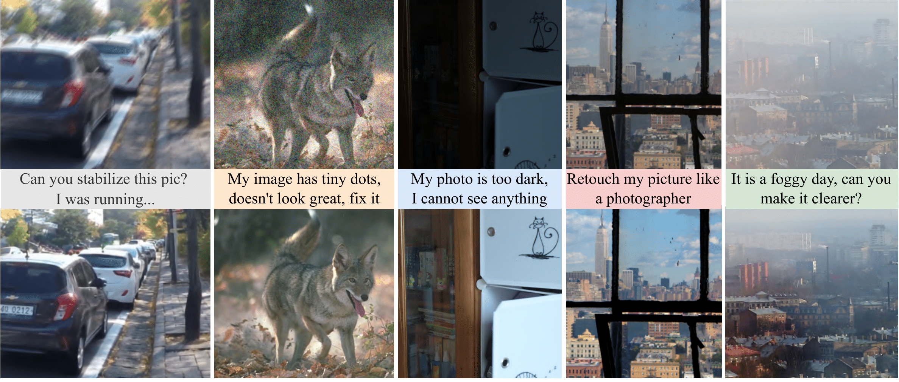
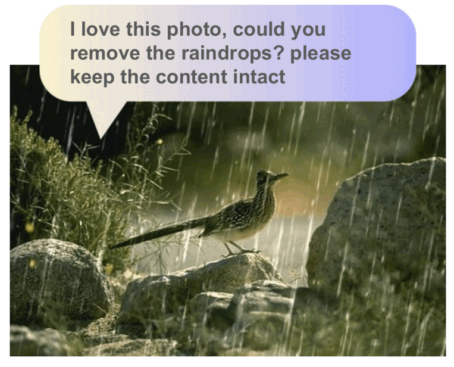
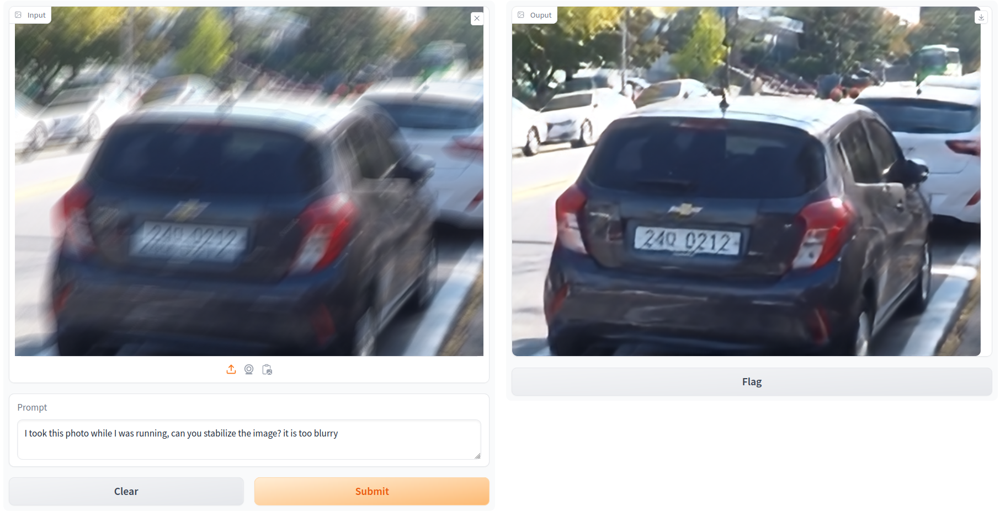
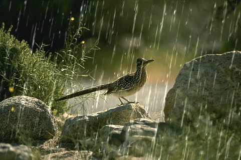
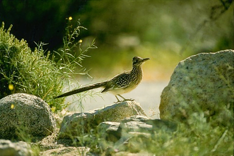
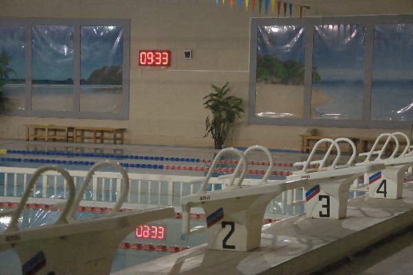
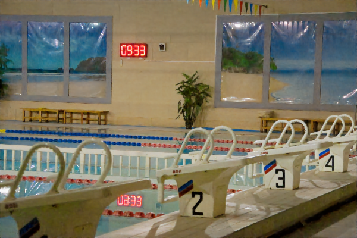
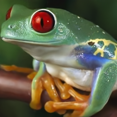

# InstructIR ✏️🖼️
## [High-Quality Image Restoration Following Human Instructions](https://mv-lab.github.io/InstructIR/)

[](https://arxiv.org/abs/2401.16468)
<a href="https://colab.research.google.com/drive/1OrTvS-i6uLM2Y8kIkq8ZZRwEQxQFchfq?usp=sharing"></a> 
[](https://huggingface.co/spaces/marcosv/InstructIR) 
[](https://replicate.com/mv-lab/instructir) 
[](https://huggingface.co/papers/2401.16468)
[](https://huggingface.co/marcosv/InstructIR)
[](https://huggingface.co/spaces/marcosv/InstructIR)


[Marcos V. Conde](https://scholar.google.com/citations?user=NtB1kjYAAAAJ&hl=en), [Gregor Geigle](https://scholar.google.com/citations?user=uIlyqRwAAAAJ&hl=en), [Radu Timofte](https://scholar.google.com/citations?user=u3MwH5kAAAAJ&hl=en)

Computer Vision Lab, University of Wuerzburg | Sony PlayStation, FTG

<a href="https://mv-lab.github.io/InstructIR/"></a>

### TL;DR: quickstart
InstructIR takes as input an image and a human-written instruction for how to improve that image. The neural model performs all-in-one image restoration. InstructIR achieves state-of-the-art results on several restoration tasks including image denoising, deraining, deblurring, dehazing, and (low-light) image enhancement.

**🚀 You can start with the [demo tutorial](demo.ipynb)**

<details>
<summary> <b> Abstract</b> (click me to read)</summary>
<p>
Image restoration is a fundamental problem that involves recovering a high-quality clean image from its degraded observation. All-In-One image restoration models can effectively restore images from various types and levels of degradation using degradation-specific information as prompts to guide the restoration model. In this work, we present the first approach that uses human-written instructions to guide the image restoration model. Given natural language prompts, our model can recover high-quality images from their degraded counterparts, considering multiple degradation types. Our method, InstructIR, achieves state-of-the-art results on several restoration tasks including image denoising, deraining, deblurring, dehazing, and (low-light) image enhancement. InstructIR improves +1dB over previous all-in-one restoration methods. Moreover, our dataset and results represent a novel benchmark for new research on text-guided image restoration and enhancement.
</p>
</details>


### TODO / News 🔥

- [x] Replicate Demo
- [ ] Upload all test results for comparisons (ETA 1st Feb)
- [x] Upload models to HF 🤗 [(download the models here)](https://huggingface.co/marcosv/InstructIR)
- [x] 🤗 [Hugging Face Demo](https://huggingface.co/spaces/marcosv/InstructIR) try it now
- [x] [Colab Tutorial](https://colab.research.google.com/drive/1OrTvS-i6uLM2Y8kIkq8ZZRwEQxQFchfq?usp=sharing) (check [demo.ipynb](demo.ipynb))

### Try it / Tutorial

[Try it]((https://huggingface.co/spaces/marcosv/InstructIR)) directly on 🤗 Hugging Face at no cost, no code.


🚀 You can start with the [demo tutorial](demo.ipynb). We also host the same tutorial on [google colab](https://colab.research.google.com/drive/1OrTvS-i6uLM2Y8kIkq8ZZRwEQxQFchfq?usp=sharing) so you can run it using free GPUs!.

<center> 
<a href="https://mv-lab.github.io/InstructIR/"></a>
</center>
<br>

#### Gradio Demo
We made a simple [Gradio demo](app.py) you can run (locally) on your machine [here](app.py). You need Python>=3.9 and [these requirements](requirements_gradio.txt) for it: `pip install -r requirements_gradio.txt`

```
python app.py
```

<center> 
<br>
<a href="https://huggingface.co/spaces/marcosv/InstructIR">  </a>
</center>

### Results

You can download the paper results from here. We test InstructIR in the following benchmarks:

| Dataset           | Task     | Test Results |
| :---------------- | :------ | ----: |
| BSD68             |   Denoising   | [Download]() |
| Urban100          |   Denoising   | [Download]() |
| Rain100           |   Deraining   | [Download]() |
| [GoPro](https://seungjunnah.github.io/Datasets/gopro)             |   Deblurring  | [Download]() |
| [LOL](https://daooshee.github.io/BMVC2018website/)               |   Lol Image Enhancement   | [Download]() |
| [MIT5K](https://data.csail.mit.edu/graphics/fivek/)             |   Image Enhancement   | [Download]() |

TODO: Add download links for all the benchmarks.

### Control and Interact

Sometimes the blur, rain, or film grain noise are pleasant effects and part of the **"aesthetics"**. Here we show a simple example on how to interact with InstructIR.

| Input       |(1) I love this photo, could you remove the raindrops? please keep the content intact | (2) Can you make it look stunning? like a professional photo     |
| ---        |    :----   |          :--- |
|       |        |    |
|   Input     |(1) my image is too dark, I cannot see anything, can you fix it? | (2) Great it looks nice! can you apply tone mapping?     |
|       |        |    |
|   Input     |(1) can you remove the tiny dots in the image? it is very unpleasant | (2) now please inprove the quality and resolution of the picture |
|       |        |    |


As you can see our model accepts diverse humman-written prompts, from ambiguous to precise instructions. *How does it work?* Imagine we have the following image as input:


Now we can use InstructIR. with the following prompt (1):
> I love this photo, could you remove the raindrops? please keep the content intact


Now, let's enhance the image a bit further (2).
> Can you make it look stunning? like a professional photo


The final result looks indeed stunning 🤗 You can do it yourself in the [demo tutorial]().

### FAQS

> Disclaimer: please remember this is not a product, thus, you will notice some limitations.

- ***How should I start?*** Check our [demo Tutorial](demo.ipynb) and also our [google collab](https://colab.research.google.com/drive/1OrTvS-i6uLM2Y8kIkq8ZZRwEQxQFchfq?usp=sharing) notebook.

- ***How can I compare with your method?*** You can download the results for several benchmarks above on [Results](###Results).

- ***How can I test the model? I just want to play with it***: Visit our 🤗 [Hugging Face demo](https://huggingface.co/spaces/marcosv/InstructIR) and test ir for free,

- ***Why aren't you using diffusion-based models?*** (1) We want to keep the solution simple and efficient. (2) Our priority is high-fidelity --as in many industry scenarios realted to computational photography--. 


### Acknowledgments
This work was partly supported by the The Humboldt Foundation (AvH). Marcos Conde is also supported by Sony Interactive Entertainment, FTG.

This work is inspired in [InstructPix2Pix](https://arxiv.org/abs/2211.09800).

### Contacts
For any inquiries contact Marcos V. Conde: <a href="mailto:marcos.conde@uni-wuerzburg.de">marcos.conde [at] uni-wuerzburg.de</a>


### Citation BibTeX

```
@misc{conde2024instructir,
    title={High-Quality Image Restoration Following Human Instructions}, 
    author={Marcos V. Conde, Gregor Geigle, Radu Timofte},
    year={2024},
    journal={arXiv preprint},
}
```
